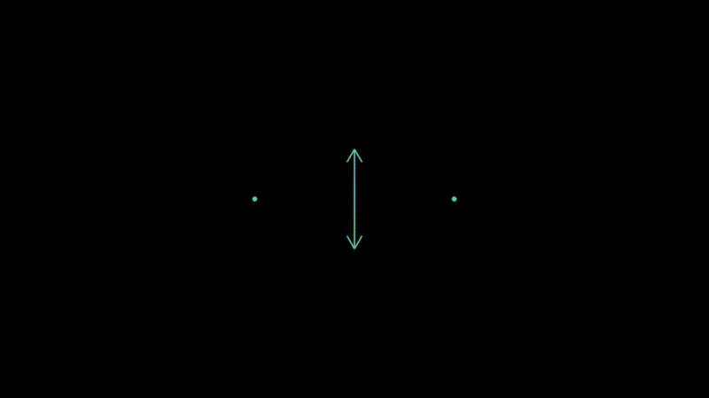
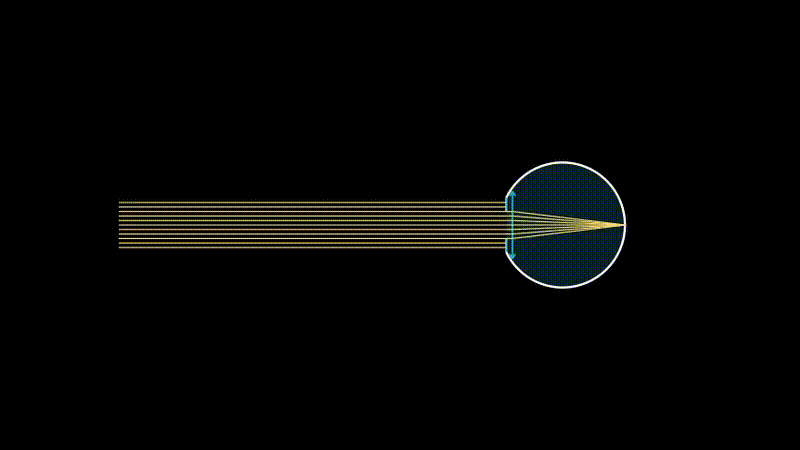
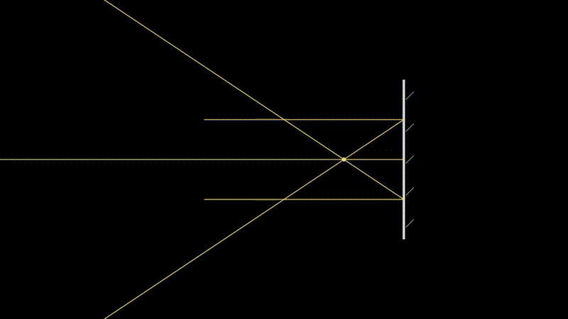

# manim_optics

Dynamic optics for Manim, built for scenes where light should behave like a living part of the animation rather than a static overlay.

manim_optics provides thin lenses, mirrors, apertures, beam stops, composite optical systems, 3D optics, and reactive rays that recompute their trajectories automatically while your scene is moving.

## Why it feels different

- Rays are dynamic objects, not pre-baked line segments.
- Optical elements can move or animate during the scene and the light path follows.
- The package covers both classroom optics and richer visual systems: eye models, principal planes, image formation, and 3D focusing.
- The API stays close to Manim conventions, so scenes remain short and readable.

## Feature Highlights

- Thin lenses: `ThinLens`, `ConvergingLens`, `DivergingLens`
- Mirrors: `PlaneMirror`, `SphericalMirror`
- Stops and apertures: `LineBeamStop`, `CircularAperture`, `ArcBeamStop`
- Reactive rays: `DynamicRay`, `RayBundle`, `PrincipalRays`
- Composite systems: `Eye`, `CenteredSystem`
- 3D optics: `OpticalElement3D`, `ThinLens3D`, `RayBundle3D`
- Measurement overlays: `LinearGraticule`, `CrossGraticule`, `GridGraticule`
- Image analysis helpers: `ImageFormation`, `ImageMarker`, `RayExtension`, `find_focal_point_from_rays`

## Installation

Install Manim first, including its native dependencies, by following the official Manim installation guide for your platform.

Then install this project from source:

```bash
git clone https://github.com/<your-account>/manim_optics.git
cd manim_optics
pip install -e .
```

If you already work in an existing Manim environment, the editable install above is the safest workflow for development and documentation examples.

## Quick Start

This is the smallest useful scene: one lens, one optical axis, one reactive bundle.

```python
import numpy as np
from manim import *
from manim_optics import OpticalScene, ConvergingLens, create_parallel_bundle


class QuickStart(OpticalScene):
    def construct(self):
        self.set_theme("dark")
        self.setup_optical_axis(length=12)

        lens = ConvergingLens(
            focal_length=2.0,
            height=3.0,
            show_focal_points=True,
        )

        rays = create_parallel_bundle(
            num_rays=7,
            spacing=0.4,
            start_x=-5.0,
            optical_elements=[lens],
            color=YELLOW,
            stroke_width=2,
        )

        self.add(rays)
        self.play(lens.create(run_time=1.0))
        self.play(rays.animate_propagation(run_time=1.6, lag_ratio=0.05))
        self.wait()
```

## Core Ideas

### Reactive ray tracing

`DynamicRay` and `RayBundle` recompute their path at every frame. If you move a lens, animate a focal length, or insert a new optical element into the system, the light adapts automatically.

### Trackers drive optics

Animatable optical properties use `ValueTracker` internally. In practice, this means focal length, pupil diameter, plane positions, aperture radius, and 3D orientation can be animated smoothly while keeping ray tracing coherent.

### Optical plane matters

For optical calculations, the important reference is the optical plane, not necessarily the visual center of the rendered object. The library uses `get_optical_plane_position()` for that reason.

### Composite systems stay explicit

Objects such as `Eye` expose `get_optical_elements()` so you can pass a physically ordered sequence directly to a ray or bundle.

## API Overview

### Optical elements

- `OpticalElement`: abstract base class for 2D optical elements
- `ThinLens`, `ConvergingLens`, `DivergingLens`: paraxial thin-lens models
- `Mirror`, `PlaneMirror`, `SphericalMirror`: reflective elements
- `BeamStop`, `LineBeamStop`, `CircularAperture`, `ArcBeamStop`: blocking or filtering elements

### Ray system

- `DynamicRay`: one continuously updated ray path
- `RayBundle`: a collection of rays with shared or independent origins and directions
- `PrincipalRays`: the three canonical construction rays for a thin lens
- `create_parallel_bundle`, `create_diverging_bundle`: convenience factories
- `ImageFormation`, `ImageMarker`, `RayExtension`: image construction and virtual-image visualization tools

### Composite and advanced systems

- `Eye`: a lens + pupil + retina optical model with accommodation support
- `CenteredSystem`: principal planes `H` and `H'` with hidden segments and teleportation-style propagation
- `OpticalElement3D`, `ThinLens3D`, `RayBundle3D`: 3D optical elements and 3D ray bundles

### Scene and utility helpers

- `OpticalScene`: Manim scene helpers such as `set_theme()`, `setup_optical_axis()`, `add_debugging_grid()`, labels, and distance markers
- `create_object_arrow`, `create_image_arrow`, `calculate_image_position`
- `Graticule`, `LinearGraticule`, `CrossGraticule`, `GridGraticule`

## Example Gallery

The gallery below is intentionally code-first. Add your rendered images or videos next to each example when you are ready.

### 1. Parallel bundle through a converging lens


```python
from manim import *
from manim_optics import ConvergingLens, create_parallel_bundle


class LensBundle(Scene):
    def construct(self):
        lens = ConvergingLens(focal_length=2.0, height=2.8, show_focal_points=True)

        rays = create_parallel_bundle(
            num_rays=5,
            spacing=0.45,
            start_x=-5,
            optical_elements=[lens],
            color=YELLOW,
        )

        self.play(lens.create())
        self.play(rays.animate_create(run_time=1.8, lag_ratio=0.08))
        self.wait()
```

### 2. Animated focal length with live ray updates



```python
import numpy as np
from manim import *
from manim_optics import ConvergingLens, RayBundle


class AnimatedFocalLength(Scene):
    def construct(self):
        lens = ConvergingLens(focal_length=2.0, height=2.0, show_focal_points=True)

        rays = RayBundle(
            start_points=[np.array([-5, y, 0]) for y in np.linspace(-0.8, 0.8, 5)],
            direction_angle_deg=[0] * 5,
            optical_elements=[lens],
            color=YELLOW,
            stroke_width=2,
        )

        self.add(lens)
        self.play(rays.animate_fade_in(run_time=1.0))
        self.play(lens.animate_focal_length(3.0, run_time=2.0))
        self.play(lens.animate_focal_length(1.5, run_time=2.0))
        self.wait()
```

### 3. Eye accommodation



```python
import numpy as np
from manim import *
from manim_optics import Eye, RayBundle


class EyeAccommodation(Scene):
    def construct(self):
        eye = Eye(
            focal_length=2.0,
            lens_diameter=1.2,
            pupil_diameter=0.5,
            include_pupil=True,
        )
        eye.shift(RIGHT * 2)

        rays = RayBundle(
            start_points=[np.array([-5, y, 0]) for y in np.linspace(-0.4, 0.4, 11)],
            direction_angle_deg=[0] * 11,
            optical_elements=eye.get_optical_elements(),
            color=YELLOW,
            stroke_width=2,
        )

        self.add(eye, rays)
        self.play(eye.animate_focal_length(1.5, run_time=2.0))
        self.play(eye.animate_pupil_diameter(0.8, run_time=1.0))
        self.wait()
```

### 4. Principal planes with `CenteredSystem`


```python
import numpy as np
from manim import *
from manim_optics import CenteredSystem, DynamicRay


class PrincipalPlanes(Scene):
    def construct(self):
        system = CenteredSystem(
            h_position=-1.5,
            h_prime_position=1.5,
            focal_length=3.0,
            height=4.0,
            show_labels=True,
            show_focal_points=True,
        )

        ray = DynamicRay(
            start_point=np.array([-6.0, 0.8, 0.0]),
            direction=RIGHT,
            optical_elements=[system],
            color=YELLOW,
            ray_length=12.0,
        )

        self.play(system.create_animation(run_time=1.8))
        self.play(Create(ray))
        self.wait()
```

### 5. Real and virtual image formation



```python
import numpy as np
from manim import *
from manim_optics import SphericalMirror, create_parallel_bundle, ImageFormation


class RealVsVirtual(Scene):
    def construct(self):
        mirror = SphericalMirror(
            position=np.array([3, 0, 0]),
            radius_of_curvature=-3,
            height=4,
            side="left",
        )

        rays = create_parallel_bundle(
            num_rays=3,
            spacing=1.0,
            start_x=-2,
            optical_elements=[mirror],
            color=YELLOW,
        )

        image = ImageFormation(
            ray_bundle=rays,
            optical_element_index=0,
            show_extensions=True,
            show_focal_point=True,
        )

        self.add(mirror, rays, image)
        self.wait()
```

### 6. Graticule overlay for optical measurements


```python
import numpy as np
from manim import *
from manim_optics import ConvergingLens, RayBundle, LinearGraticule


class MeasuredFocus(Scene):
    def construct(self):
        lens = ConvergingLens(focal_length=2.0, height=3.0, color=BLUE_C)
        lens.shift(RIGHT)

        rays = RayBundle(
            start_points=[np.array([-5, y, 0]) for y in np.linspace(-1, 1, 5)],
            direction_angle_deg=[0] * 5,
            optical_elements=[lens],
            color=YELLOW,
            stroke_width=2,
        )

        graticule = LinearGraticule(
            direction=UP,
            length=4,
            unit_length=0.5,
            primary_interval=1,
            secondary_interval=0.1,
            tick_position="outside",
            show_labels=True,
            decimal_places=1,
        )
        graticule.shift(RIGHT * 3)

        self.play(lens.create())
        self.add(rays)
        self.play(rays.animate_propagation(run_time=1.8))
        self.play(graticule.create_animation(run_time=1.0))
        self.wait()
```

### 7. 3D focusing


```python
import numpy as np
from manim import *
from manim_optics import ThinLens3D, RayBundle3D


class Focal3D(ThreeDScene):
    def construct(self):
        lens = ThinLens3D(
            focal_length=4.0,
            aperture_radius=2.5,
            position=ORIGIN,
            normal_vector=RIGHT,
            display_mode="simple",
            color=BLUE_E,
            opacity=0.6,
            show_focal_points=True,
        )

        ray_starts = [
            np.array([-6, y, z])
            for y in np.linspace(-2, 2, 5)
            for z in np.linspace(-2, 2, 5)
        ]

        rays = RayBundle3D(
            start_points=ray_starts,
            direction_vector=RIGHT,
            optical_elements=[lens],
            color=YELLOW,
            stroke_width=2,
            max_length=12,
        )

        self.set_camera_orientation(phi=70 * DEGREES, theta=-45 * DEGREES, zoom=0.6)
        self.play(FadeIn(lens))
        self.play(Create(rays), run_time=2.0)
        self.wait()
```

## Project Structure

```text
manim_optics/
  __init__.py
  base.py
  lenses.py
  mirrors.py
  beam_stops.py
  eye.py
  centered_system.py
  optics_3d.py
  rays.py
  scene_utils.py
  miscellaneous.py
test/
  test_lens_tips.py
  test_ray_animations.py
  test_dynamic_optical_elements.py
  test_centered_system.py
  test_eye.py
  test_virtual_detection.py
  test_graticule.py
  test_focal_3d.py
  ...
```

## Running Example Scenes

Render a scene from the `test/` directory with Manim:

```bash
manim test/test_ray_animations.py TestRayAnimations -pql
```

Useful scene entry points:

- `TestRayAnimations` for bundle animation methods
- `TestDynamicRayWithFocal` for focal-length updates
- `TestCenteredSystemBasic` for principal planes and hidden segments
- `TestEyeAccommodation` for accommodation and pupil changes
- `TestVirtualDetection` for real vs virtual image behavior
- `TestGraticuleWithOptics` for measurement overlays
- `TestFocal3DParallel` for 3D focusing

## Development Notes

- Public exports are defined in `manim_optics/__init__.py`.
- The ray system relies heavily on updaters, so examples should prefer real scene animations over static screenshots when validating behavior.
- For optical calculations, prefer APIs such as `get_optical_plane_position()` instead of visual-center shortcuts.
- If you create new animatable optical elements, mirror the existing `ValueTracker` pattern so ray tracing stays synchronized during interpolation.

## License

MIT
